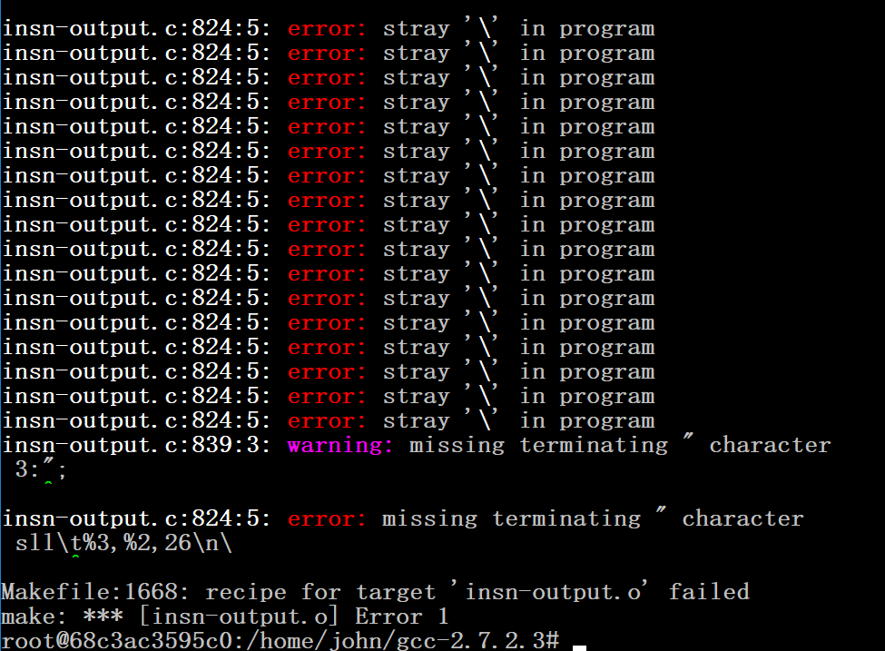
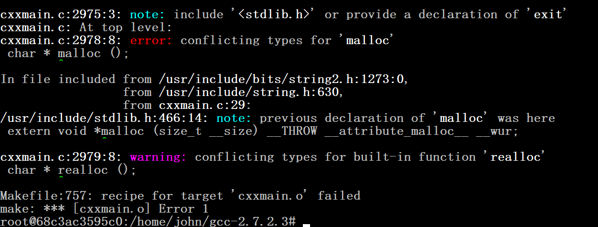
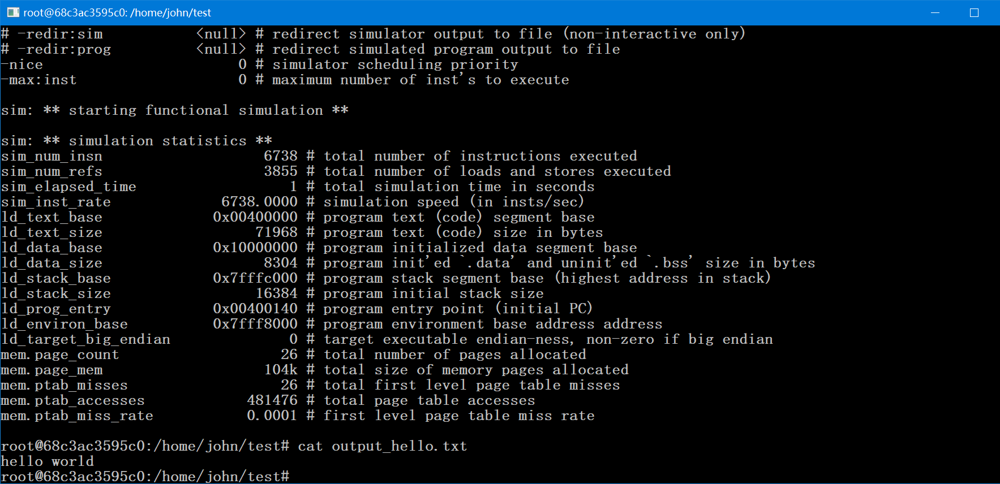

# 实验 1：SimpleScalar 的安装与配置

> 2017/6/1

[heading-numbering]

## 目录 [no-toc] [no-number]

[TOC]

## 实验目的

安装实验平台并熟悉实验环境，为今后的学习做准备。

## 实验要求

1. 搭建 SimpleScalar（3.0e 版本）模拟器环境，并运行 hello world，写详细的搭建报告，截图展示具体过程。
2. 利用 SimpleScalar 工具链编译 Mibench‐auotomotive 基准测试包。

## 实验环境

- Ubuntu 16.04（docker 自带）
- gcc 5.4（Ubuntu 16.04 自带）

## 实验步骤

### 进入实验环境

本次实验使用 docker 上的 Ubuntu 16.04 镜像，所有的操作在 docker 中完成（默认是 `root`）。好处是：

- 可以很方便的恢复原来的状态，避免直接对系统操作
- 安装完成后，可以保存镜像，方便之后的实验

``` bash
sudo apt-get install docker
docker run -i -t ubuntu:16.04
```

### 安装依赖包

由于 docker 上的镜像比较原始，需要我们安装实验的依赖包：

- 使用 `update` 更新包的来源
- 安装 `git` 和 `curl` 用于下载我们需要的源文件
- 安装 `build-essential` `flex` `bison` 用于 `gcc` 构建程序
- 安装 `libc6-dev-i386` 用于编译系统相关内容

``` bash
apt-get update
apt-get install -y git curl
apt-get install -y build-essential flex bison libc6-dev-i386
```

### 配置环境变量

- 设置环境变量
- 创建实验需要的目录

``` bash
export IDIR=/home/john
export HOST=i686-pc-linux
export TARGET=sslittle-na-sstrix
mkdir $IDIR
```

### 下载实验需要的文件

- 从官网下载 `simple sim` 和 `simple tools`
  - 使用 `curl -e` 伪造 **同意** 的请求
- 从其他网站下载 `simple utils` 和 `gcc-2.7.2.3` 交叉编译器
- 从 `git` 上下载 之后需要的 `ar` 和 `ranlib`

``` bash
cd $IDIR
curl http://www.simplescalar.com/gatedftp.php3?simplesim-3v0e.tgz -e http://www.simplescalar.com/agreement.php3?simplesim-3v0e.tgz -o simplesim-3v0e.tgz  ## spoofing :-)
curl http://www.simplescalar.com/downloads/simpletools-2v0.tgz -o simpletools-2v0.tgz
curl http://www.cse.iitd.ernet.in/~cs5070217/csl718/simpleutils-990811.tar.gz -o simpleutils-990811.tar.gz
curl http://american.cs.ucdavis.edu/RAD/gcc-2.7.2.3.ss.tar.gz -o gcc-2.7.2.3.ss.tar.gz
git clone https://github.com/BOT-Man-JL/simple-scalar
```

为了方便其他人的下载，所有需要的文件已经放到 https://github.com/BOT-Man-JL/simple-scalar 仓库中，可以使用 `git clone` 获取文件：

``` bash
git clone https://github.com/BOT-Man-JL/simple-scalar
```

### 安装 Simple Utilities

- 解压源文件
- 用 `sed` 解决源代码里的 **拼写错误**（`yy_current_buffer` 替换为 `YY_CURRENT_BUFFER`）
- 使用 `configure` 配置
- 使用 `make` 生成代码

``` bash
cd $IDIR
tar -xf simpleutils-990811.tar.gz
rm simpleutils-990811.tar.gz

cd $IDIR/simpleutils-990811
find . -name ldlex.l -exec sed -i 's/yy_current_buffer/YY_CURRENT_BUFFER/g' {} \;  ## fix typo
./configure --host=$HOST --target=$TARGET --with-gnu-as --with-gnu-ld --prefix=$IDIR
make CFLAGS=-O
make install
```

### 安装 Simple Sim

- 解压源文件
- 使用 `make` 生成 `config-pisa` 和 目标程序
  - 最后 `make` 提示 `my work is done here...` 表示成功
- 使用 `update-alternatives` 建立别名，方便之后实验的进行（避免使用环境变量）

``` bash
cd $IDIR
tar -xf simplesim-3v0e.tgz
rm simplesim-3v0e.tgz

cd $IDIR/simplesim-3.0
make config-pisa
make

update-alternatives --install /bin/sim-safe sim-safe $IDIR/simplesim-3.0/sim-safe 100
update-alternatives --install /bin/sim-outorder sim-outorder $IDIR/simplesim-3.0/sim-outorder 100
update-alternatives --install /bin/sim-bpred sim-bpred $IDIR/simplesim-3.0/sim-bpred 100
```

### 配置 Simple Tools 和 gcc 交叉编译器

- 解压源文件
- 替换 `sslittle-na-sstrix/bin/` 路径下的 `ar` 和 `ranlib`
- 给 `ar` 和 `ranlib` 可执行权限

``` bash
cd $IDIR
tar -xf simpletools-2v0.tgz
tar -xf gcc-2.7.2.3.ss.tar.gz
rm simpletools-2v0.tgz
rm -rf gcc-2.6.3
rm gcc-2.7.2.3.ss.tar.gz

mv simple-scalar/ar $IDIR/sslittle-na-sstrix/bin/
mv simple-scalar/ranlib $IDIR/sslittle-na-sstrix/bin/
rm simple-scalar -rf
chmod +x $IDIR/sslittle-na-sstrix/bin/ar
chmod +x $IDIR/sslittle-na-sstrix/bin/ranlib
```

### 第一次编译 gcc 交叉编译器

- 使用 `configure` 配置
- 在 `Makefile` 的 130 行尾，加入 `-I/usr/include`
- 在 `protoize.c` 的 60 行，`varargs.h` 改为 `stdarg.h`
- 在 `obstack.h` 的 341 行，`next_free)++` 改为 `next_free++)`
- 拷贝 `cdefs.h`，`libc.a` 和 `crt0.o` 文件
- 使用 `gcc -m32` 编译 32 位目标

``` bash
cd $IDIR/gcc-2.7.2.3
./configure --host=$HOST --target=$TARGET --with-gnu-as --with-gnu-ld --prefix=$IDIR
sed '130s/GCC_CFLAGS=$(INTERNAL_CFLAGS) $(X_CFLAGS) $(T_CFLAGS) $(CFLAGS) -I.\/include/GCC_CFLAGS=$(INTERNAL_CFLAGS) $(X_CFLAGS) $(T_CFLAGS) $(CFLAGS) -I.\/include -I\/usr\/include/g' Makefile -i
sed '60s/#include <varargs.h>/#include <stdarg.h>/g' protoize.c -i
sed '341s/next_free)++/next_free++)/g' obstack.h -i
cp ./patched/sys/cdefs.h ../sslittle-na-sstrix/include/sys/cdefs.h
cp ../sslittle-na-sstrix/lib/libc.a ../lib/
cp ../sslittle-na-sstrix/lib/crt0.o ../lib/
make LANGUAGES=c CFLAGS=-O CC="gcc -m32"
```

第一次编译后会报错（原因是编译器自动生成的代码 `insn-output.c` 有问题）：



### 第二次编译 gcc 交叉编译器

- 使用 `sed` 修正 `insn-output.c` 所有出错的地方（行尾加一个 `\`）
- 重新编译

``` bash
cd $IDIR/gcc-2.7.2.3
sed 's/FIXME\\n/FIXME\\n\\/g' insn-output.c -i
make LANGUAGES=c CFLAGS=-O CC="gcc -m32"
```

第二次编译会从上次错误的地方继续编译，但会报错（原因是编译器自动生成的代码 `cxxmain.c` 重复声明了 `malloc` 和 `realloc`）



### 第三次编译 gcc 交叉编译器

- 使用 `sed` 删除 `cplus-dem.c` 的 2978 和 2979 行
  - **这里和讲义不一样**，因为对 `cxxmain.c` 的修改会在重新 make 的时候失效
- 重新编译，这次编译不会报错

``` bash
cd $IDIR/gcc-2.7.2.3
sed '2978s/.*//g' cplus-dem.c -i
sed '2979s/.*//g' cplus-dem.c -i
make LANGUAGES=c CFLAGS=-O CC="gcc -m32"
```

### 编译 gcc 的 enquire 和 安装 gcc 交叉编译器

- 使用 `sed` 修正 Makefile 对 enquire 的缺失参数
- make enquire
  - **这里和讲义不一样**，如果不指定 `-m32` 会导致构建出 64 位目标，与之前的 32 位不匹配
- 使用 `sim-safe` 生成 `float.h-cross` 代码
- 最后编译 `install`
- 使用 `update-alternatives` 导出别名

``` bash
cd $IDIR/gcc-2.7.2.3
sed 's/ENQUIRE_CFLAGS =/ENQUIRE_CFLAGS = -D_GNU_SOURCE/g' Makefile -i
make enquire CC="gcc -m32"
sim-safe ./enquire -f > float.h-cross
make LANGUAGES=c CFLAGS=-O CC="gcc -m32" install

update-alternatives --install /bin/sgcc sgcc $IDIR/bin/sslittle-na-sstrix-gcc 100
```

### 测试 SimpleScalar

- 生成测试文件
- 使用我们构建的程序编译、运行

``` bash
mkdir $IDIR/test
cd $IDIR/test
printf '#include <stdio.h> \nmain () { printf ("hello world\\n"); }' > hello.c
sgcc hello.c -o hello
sim-safe hello > output_hello.txt
cat output_hello.txt
```

结果为：



### 提交 docker

本次实验的结果已提交到 docker 服务器上，可以通过以下命令获取镜像：

``` bash
docker pull botmanjl/simplescalar
```

> 起初，我打算使用别人部署的 docker 环境进行之后的实验；但是发现现有的 docker 环境的安装都有问题，所以自己重现做了 实验 1。

## 完整安装脚本

``` bash
# Install Packages

apt-get update
apt-get install -y curl git
apt-get install -y build-essential flex bison libc6-dev-i386  ## fix sys include hell

# Setup Env Vars

export IDIR=/home/john
export HOST=i686-pc-linux
export TARGET=sslittle-na-sstrix
mkdir $IDIR

# Download Files

cd $IDIR
curl http://www.simplescalar.com/gatedftp.php3?simplesim-3v0e.tgz -e http://www.simplescalar.com/agreement.php3?simplesim-3v0e.tgz -o simplesim-3v0e.tgz  ## spoofing :-)
curl http://www.simplescalar.com/downloads/simpletools-2v0.tgz -o simpletools-2v0.tgz
curl http://www.cse.iitd.ernet.in/~cs5070217/csl718/simpleutils-990811.tar.gz -o simpleutils-990811.tar.gz
curl http://american.cs.ucdavis.edu/RAD/gcc-2.7.2.3.ss.tar.gz -o gcc-2.7.2.3.ss.tar.gz
git clone https://github.com/BOT-Man-JL/simple-scalar

# Install SimpleUtils

cd $IDIR
tar -xf simpleutils-990811.tar.gz
rm simpleutils-990811.tar.gz

cd $IDIR/simpleutils-990811
find . -name ldlex.l -exec sed -i 's/yy_current_buffer/YY_CURRENT_BUFFER/g' {} \;  ## fix typo
./configure --host=$HOST --target=$TARGET --with-gnu-as --with-gnu-ld --prefix=$IDIR
make CFLAGS=-O
make install

# Install SimpleSim

cd $IDIR
tar -xf simplesim-3v0e.tgz
rm simplesim-3v0e.tgz

cd $IDIR/simplesim-3.0
make config-pisa
make

update-alternatives --install /bin/sim-safe sim-safe $IDIR/simplesim-3.0/sim-safe 100
update-alternatives --install /bin/sim-outorder sim-outorder $IDIR/simplesim-3.0/sim-outorder 100
update-alternatives --install /bin/sim-bpred sim-bpred $IDIR/simplesim-3.0/sim-bpred 100

# Config SimpleTools and gcc

cd $IDIR
tar -xf simpletools-2v0.tgz
tar -xf gcc-2.7.2.3.ss.tar.gz
rm simpletools-2v0.tgz
rm -rf gcc-2.6.3
rm gcc-2.7.2.3.ss.tar.gz
mv simple-scalar/ar $IDIR/sslittle-na-sstrix/bin/
mv simple-scalar/ranlib $IDIR/sslittle-na-sstrix/bin/
rm simple-scalar -rf
chmod +x $IDIR/sslittle-na-sstrix/bin/ar
chmod +x $IDIR/sslittle-na-sstrix/bin/ranlib

# 1st Make gcc

cd $IDIR/gcc-2.7.2.3
./configure --host=$HOST --target=$TARGET --with-gnu-as --with-gnu-ld --prefix=$IDIR
sed '130s/GCC_CFLAGS=$(INTERNAL_CFLAGS) $(X_CFLAGS) $(T_CFLAGS) $(CFLAGS) -I.\/include/GCC_CFLAGS=$(INTERNAL_CFLAGS) $(X_CFLAGS) $(T_CFLAGS) $(CFLAGS) -I.\/include -I\/usr\/include/g' Makefile -i
sed '60s/#include <varargs.h>/#include <stdarg.h>/g' protoize.c -i
sed '341s/next_free)++/next_free++)/g' obstack.h -i
cp ./patched/sys/cdefs.h ../sslittle-na-sstrix/include/sys/cdefs.h
cp ../sslittle-na-sstrix/lib/libc.a ../lib/
cp ../sslittle-na-sstrix/lib/crt0.o ../lib/
make LANGUAGES=c CFLAGS=-O CC="gcc -m32"

# 2nd Make gcc

cd $IDIR/gcc-2.7.2.3
sed 's/FIXME\\n/FIXME\\n\\/g' insn-output.c -i
make LANGUAGES=c CFLAGS=-O CC="gcc -m32"

# 3rd Make gcc

cd $IDIR/gcc-2.7.2.3
sed '2978s/.*//g' cplus-dem.c -i
sed '2979s/.*//g' cplus-dem.c -i
make LANGUAGES=c CFLAGS=-O CC="gcc -m32"

# Make enquire and Install

cd $IDIR/gcc-2.7.2.3
sed 's/ENQUIRE_CFLAGS =/ENQUIRE_CFLAGS = -D_GNU_SOURCE/g' Makefile -i
make enquire CC="gcc -m32"
sim-safe ./enquire -f > float.h-cross
make LANGUAGES=c CFLAGS=-O CC="gcc -m32" install

update-alternatives --install /bin/sgcc sgcc $IDIR/bin/sslittle-na-sstrix-gcc 100

# Test

mkdir $IDIR/test
cd $IDIR/test
printf '#include <stdio.h> \nmain () { printf ("hello world\\n"); }' > hello.c
sgcc hello.c -o hello
sim-safe hello > output_hello.txt
cat output_hello.txt
```

## 实验总结

本次实验中，学到了如何使用 Linux 下的工具，进行 SimpleScalar 的安装和配置，为之后的实验做准备。