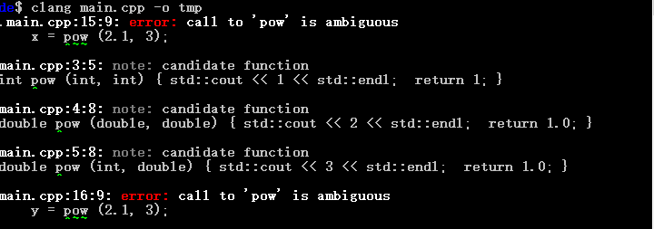
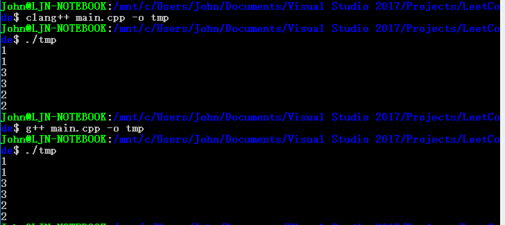
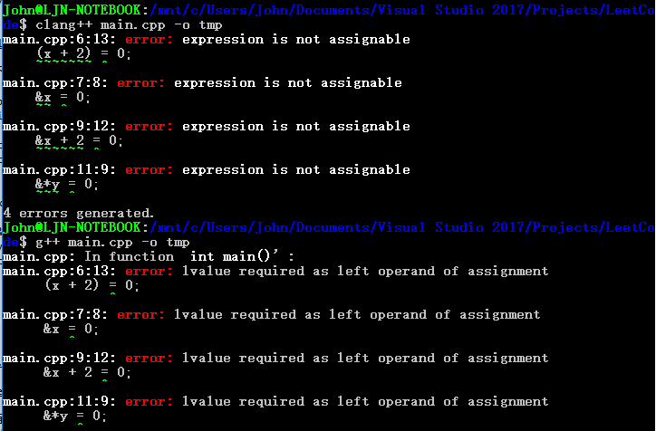
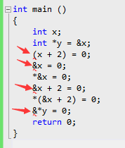
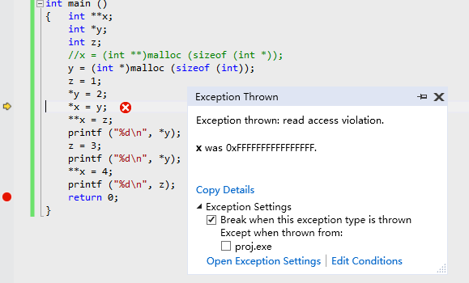

# PLPP (Kenneth C.Louden) Chap. 5 Exercises

> 2014211288 李俊宁
>
> 2017/4/21

## TOC

[TOC]

[page-break]

## Q-5.7

### Question

本章中提到，C 和 C++ 明确区分声明和定义。下面哪些是声明，哪些是定义：
 
``` cpp
(a) char *name;
(b) typedef int *IntPtr;
(c) struct rec;
(d) int gcd (int, int);
(e) double y;
(f) extern int z;
```

### Solution

| 声明 | 解释 |
|--|--|
| `(b) typedef int *IntPtr;` | 声明一个 **类型构造器** `IntPtr` 为 `int *` |
| `(c) struct rec;` | 声明一个 `struct`，名为 `rec` |
| `(d) int gcd (int, int);` | 声明一个 **函数** `gcd`，输入是两个 `int`，输出为 `int` |
| `(f) extern int z;` | 声明一个 **外部变量** `z`，类型为 `int` |

| 定义 | 解释 |
|--|--|
| `(a) char *name;` | 定义一个变量 `name`，类型为 `char *` |
| `(e) double y;` | 定义一个变量 `y`，类型为 `double` |

## Q-5.8

### Question

使用本章描述过的符号表的第一种组织结构（单一简单表），按照要求画出下面 C 程序的符号表：(a) 使用词法范围；(b) 使用动态范围。在各自范围规则作用下，程序分别打印出什么？

``` c
#include <stdio.h>

int a, b;

int p () {
    int a, p;
    /* point 1 */
    a = 0; b = 1; p = 2;
    return p;
}

void print () {
    printf ("%d\n%d\n", a, b);
}

void q () {
    int b;
    /* point 2 */
    a = 3; b = 4;
    print ();
}

void main () {
    /* point 3 */
    a = p ();
    q ();
}
```

### Solution

首先，程序执行过程是：

- main
  - p
  - q
    - print

#### 词法范围

- `point 3` (`main`)

| 变量 |
|--|
| a | **全局变量** |
| b | **全局变量** |
| p | **函数** `p` |
| q | **函数** `q` |
| print | **函数** `print` |
| main | **函数** `main` |

- `point 1` (`p`)

| 变量 |
|--|
| a | 函数 `p` 中的**局部变量** | **全局变量** |
| b | **全局变量** |
| p | 函数 `p` 中的**局部变量** | **函数** `p` |

- `point 2` (`q`)

| 变量 |
|--|
| a | **全局变量** |
| b | 函数 `q` 中的**局部变量** | **全局变量** |
| p | **函数** `p` |
| print | **函数** `print` |
| q | **函数** `q` |

- `print`

| 变量 |
|--|
| a | **全局变量** |
| b | **全局变量** |
| p | **函数** `p` |
| print | **函数** `print` |

所以，打印：

```
3
1
```

#### 动态范围

- `point 3` (`main`)

| 变量 |
|--|
| a | **全局变量** |
| b | **全局变量** |
| p | **函数** `p` |
| q | **函数** `q` |
| print | **函数** `print` |
| main | **函数** `main` |

- `point 1` (`p`)

| 变量 |
|--|
| a | 函数 `p` 中的**局部变量** | **全局变量** |
| b | **全局变量** |
| p | 函数 `p` 中的**局部变量** | **函数** `p` |
| q | **函数** `q` |
| print | **函数** `print` |
| main | **函数** `main` |

- `point 2` (`q`)

| 变量 |
|--|
| a | **全局变量** |
| b | 函数 `q` 中的**局部变量** | **全局变量** |
| p | **函数** `p` |
| q | **函数** `q` |
| print | **函数** `print` |
| main | **函数** `main` |

- `print`

| 变量 |
|--|
| a | **全局变量** |
| b | 函数 `q` 中的**局部变量** | **全局变量** |
| p | **函数** `p` |
| q | **函数** `q` |
| print | **函数** `print` |
| main | **函数** `main` |

所以，打印：

```
3
4
```

## Q-5.14

### Question

下面的程序打印两个整数值：第一个值通常是无用单元（或者可能是 0，如果你在一个掉时期或者其他控制环境中执行的话），而第二个值将是 2。请解释为什么。

``` c
#include <stdio.h>

void p ()
{
    int y;
    printf ("%d\n", y);
    y = 2;
}

int main ()
{
    p(); p();
    return 0;
}
```

### Solution

通过实验，发现在 Ubuntu 下两个编译器结果满足题目要求，而 Windows 下的 VC 不满足。

#### 在 Ubuntu 下，使用 clang / gcc 编译


解释：
- 将代码中的 `printf ("%d\n", y);` 改为 `printf ("%p\n", &y);`，会发现：两次调用时，`y` 对应的地址相同，即在函数调用的栈区位置相同
- 前一次栈上相应位置上是 `0x00000000`，后一次是 `0x01000000`（little endian）
- 所以，打印分别是 `0` 和 `2`

（改为打印指针后截图）


#### 在 Windows 下，使用 Visual C++ 编译

没有得到题目描述的效果，是因为在调用函数压栈时，编译器做了其他工作：
- Debug Mode
  - 输出：`-858993460` 和 `-858993460`
  - 解释：在**调试模式**下，调用函数时，栈上会被填充 `0xCCCCCCCC`，对应 `-858993460`（作用是**检测未赋值变量的使用**）
- Release Mode
  - 输出：`0` 和 `0`
  - 解释：在**发布模式**下，调用函数前，栈上会被填充 `0x00000000`，对应 `0`

## Q-5.15

### Question

下面的程序打印两个整数值：第一个通常是无用单元（或者可能是 0，如果你在一个掉时期或者其他控制环境中执行的话），而第二个值将是 2。请解释为什么。

``` cpp
#include <stdio.h>

int main ()
{
    {
        int x;
        printf ("%d\n", x);
        x = 2;
    }
    {
        int y;
        printf ("%d\n", y);
    }
    return 0;
}
```

### Solution

通过实验，发现常用的三款编译器**没有一款满足要求**。

#### 效果


- VC
  - Debug Mode: `-858993460` 和 `-858993460`
  - Release Mode: `0` 和 `0`

将打印值改为打印地址后：


#### 解释

- **题目中的编译器**
  - 在 `x` 作用域离开后，`y` 使用**相同的栈区空间**
  - 所以，`x = 2;` 填充 `y` 的值为 `2`
- clang
  - 在 `x` 作用域离开后，`y` 使用**不同的栈区空间**
  - 所以，`x = 2;` 不影响之后 `y` 的值
- gcc 和 VC
  - 在 `x` 作用域离开后，`y` 使用**相同的栈区空间**
  - 但是，编译器在清空栈区之前，会做相应的填充 `0xCCCCCCCC` (VC Debug) 或 `0x00000000` (gcc / VC Release)
  - 所以，得到的结果为**填充值**

## Q-5.17

### Question

假设下面的函数声明（使用 C++ 语法）在程序中是可用的：

``` cpp
(1) int pow (int, int);
(2) double pow (double, double);
(3) double pow (int, double);
```

并假设一下代码调用 `pow` 函数：

``` cpp
int x;
double y;
x = pow(2,3);
y = pow(2,3);
x = pow(2,3.2);
y = pow(2,3.2);
x = pow(2.1,3);
y = pow(2.1,3);
x = pow(2.1,3.2);
y = pow(2.1,3.2);
```

给定语言 (a) C++；(b) Java；或 (c) Ada，写出 8 次调用 `pow` 函数得到的值，若在函数语言中无法解析或者数据类型转化无法完成，则写“非法”。

### Solution

使用 C++ 语言，该语言重载规则为：

- **根据参数**最优匹配候选函数
- **不根据返回值**重载函数（上下文无关）
- 遇到**歧义**时，不主动进行类型转换

使用以下代码测试：

``` cpp
#include <iostream>

int pow (int, int) { std::cout << 1 << std::endl;  return 1; }
double pow (double, double) { std::cout << 2 << std::endl;  return 1.0; }
double pow (int, double) { std::cout << 3 << std::endl;  return 1.0; }

int main ()
{
    int x;
    double y;
    x = pow (2, 3);
    y = pow (2, 3);
    x = pow (2, 3.2);
    y = pow (2, 3.2);
    x = pow (2.1, 3);
    y = pow (2.1, 3);
    x = pow (2.1, 3.2);
    y = pow (2.1, 3.2);
    return 0;
}
```

#### 在 Ubuntu 下，使用 clang / gcc 编译



删掉无法编译行后，重新编译：



无法编译，重载情况为：

| 表达式 | 重载 |
|--|--|
| pow (2, 3) | `(1) int pow (int, int);` |
| pow (2, 3.2) | `(3) double pow (int, double);` |
| pow (2.1, 3) | 非法 |
| pow (2.1, 3.2) | `(2) double pow (double, double);` |

#### 在 Windows 下，使用 Visual C++ 编译

由于该编译器不遵循语言规范，可以正常编译，重载情况为：

| 表达式 | 重载 |
|--|--|
| pow (2, 3) | `(1) int pow (int, int);` |
| pow (2, 3.2) | `(3) double pow (int, double);` |
| pow (2.1, 3) | 将 `3` 转为 `3.0`，然后匹配 `(2) double pow (double, double);` |
| pow (2.1, 3.2) | `(2) double pow (double, double);` |

## Q-5.24

### Question

以下哪些 C 语言表达式是 l-value，哪些不是，为什么（假定 x 是 int 变量，y 是 int* 变量）：

``` cpp
(1) x + 2
(2) &x
(3) *&x
(4) &x + 2
(5) *(&x + 2)
(6) &*y
```

### Solution

使用以下代码测试：

``` cpp
int main ()
{
    int x;
    int *y = &x;
    (x + 2) = 0;
    &x = 0;
    *&x = 0;
    (&x + 2) = 0;
    *(&x + 2) = 0;
    &*y = 0;
    return 0;
}
```

#### 在 Ubuntu 下，使用 clang / gcc 编译



#### 在 Windows 下，使用 Visual C++ 编译



#### 分析

| 表达式 | 结果 |
|--|--|
| `x + 2` | 右值，计算结果 |
| `&x` | 右值，取地址结果 |
| `*&x` | 左值，解引用结果 |
| `&x + 2` | 右值，计算结果 |
| `*(&x + 2)` | 左值，解引用结果 |
| `&*y` | 右值，取地址结果 |

## Q-5.26

### Question

给定下面的 C 语言程序，画出每一次对 `**x` 赋值（第 11 行和第 15 行）后的变量的 box-and-circle 图。哪些变量互为别名？程序打印出的值是什么？

``` cpp
(1) #include <stdio.h>
(2) int main ()
(3) {   int **x;
(4)     int *y;
(5)     int z;
(6)     x = (int **) malloc (sizeof (int *));
(7)     y = (int *) malloc (sizeof (int));
(8)     z = 1;
(9)     *y = 2;
(10)    *x = y;
(11)    **x = z;
(12)    printf ("%d\n", *y);
(13)    z = 3;
(14)    printf ("%d\n", *y);
(15)    **x = 4;
(16)    printf ("%d\n", z);
(17)    return 0;
(18)}
```

### Solution

#### box-and-circle 图

[img=max-height:100mm]


[align-center]

图 1（第 11 行）

[img=max-height:100mm]


[align-center]

图 2（第 15 行）

#### 变量别名

- `*x` 和 `y` 互为别名
- `**x` 和 `*y` 互为别名

#### 程序打印


```
1
1
3
```

## Q-5.27

### Question

解释在上面的习题例子中，两次调用 `malloc`（第 6 行和第 7 行）的原因。如果删除第 6 行，会有什么事情发生？删除第 7 行呢？

### Solution

- 作用是：在使用 `x` 和 `y` 之前，给他们申请空间并赋值。
- 删掉之后：可能导致**对无效地址解引用**，程序异常。

> 在 Ubuntu 下的 clang 和 gcc 编译后运行，有时候可以通过；但是为了验证其效果，这里选择 VC 做检查。

#### 去掉第 6 行

导致第 10 行 `*x = y;` 失败：

[img=max-width:120mm]



#### 去掉第 7 行

导致第 9 行 `*y = 2;` 失败：

[img=max-width:120mm]


## Q-5.28

### Question

针对下面的代码，重新按照习题 5.26 的要求给出解释：

``` cpp
(1) #include <stdio.h>
(2) int main ()
(3) {   int **x;
(4)     int *y;
(5)     int z;
(6)     x = &y;
(7)     y = &z;
(8)     z = 1;
(9)     *y = 2;
(10)    *x = y;
(11)    **x = z;
(12)    printf ("%d\n", *y);
(13)    z = 3;
(14)    printf ("%d\n", *y);
(15)    **x = 4;
(16)    printf ("%d\n", z);
(17)    return 0;
(18)}
```

### Solution

#### box-and-circle 图

第 11 和 15 行的 `**x` 赋值位置的图相同（第一次 `z` 为 `2`，第二次为 `4`）：

[img=max-height:100mm]


#### 变量别名

- `*x` 和 `y` 互为别名
- `**x` 和 `*y` 和 `z` 互为别名

#### 程序打印


```
2
3
4
```

## Q-5.31

### Question

为什么下面的 C 语言代码是非法的：

``` cpp
{
    int x;
    &x = (int *) malloc (sizeof (int));
    ...
}
```

### Solution


`&x` 是**右值表达式**，不能被赋值。

## Q-5.32

### Question

为什么下面的 C 语言代码是非法的：

``` cpp
{
    int x[3];
    x = (int *) malloc (3 * sizeof (int));
    ...
}
```

### Solution


`x` 类型是 `int [3]`，**不能被赋值**。

> 注：
> 如果是 `int x[3], y[3]; x = y;` 也不能通过。

## Q-5.33

### Question

下面是一个带有函数变量的合法 C 语言程序：

``` c
(1) #include <stdio.h>
(2) int gcd (int u, int v)
(3) {   if (v == 0) return u;
(4)     else return gcd (v, u % v);
(5) }
(6) int (*fun_var) (int, int) = &gcd;
(7) int main ()
(8) {   printf ("%d\n", (*fun_var)(15, 10));
(9)     return 0;
(10)}
```

将代码中的第 6 行与第 8 行和下面的代码相应语句（第 1 行与第 3 行）做比较。为什么这种版本的代码是允许的？为什么它不是必需的？

``` c
(1) int (*fun_var) (int, int) = gcd;
(2) int main ()
(3) {   printf ("%d\n", fun_var (15, 10));
(4)     return 0;
(5) }
```

### Solution

两种版本代码运行结果相同：


C 语言规定：

- `int (*fun_var) (int, int)` 定义变量 `fun_var` 为**函数指针**类型
- 对于一个函数名，取地址、解引用得到的值不变，即 `gcd`, `&gcd`, `*gcd`, `*(&gcd)`, `&(*gcd)` 均相同
- 对于一个函数指针，解引用、不解引用都可以调用